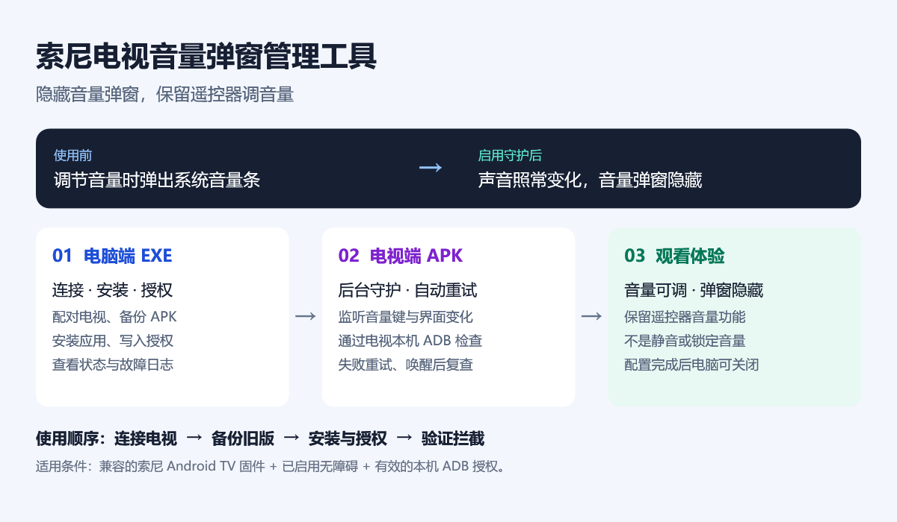
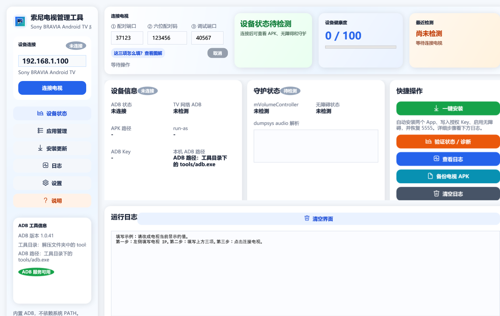
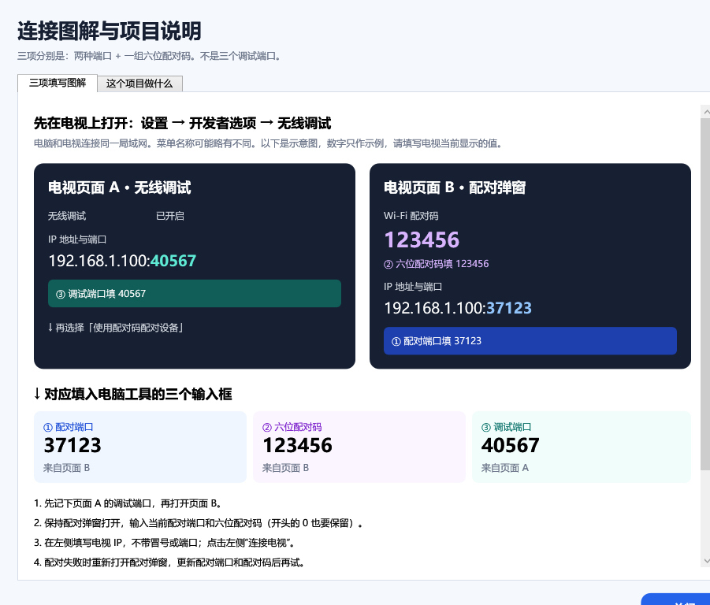
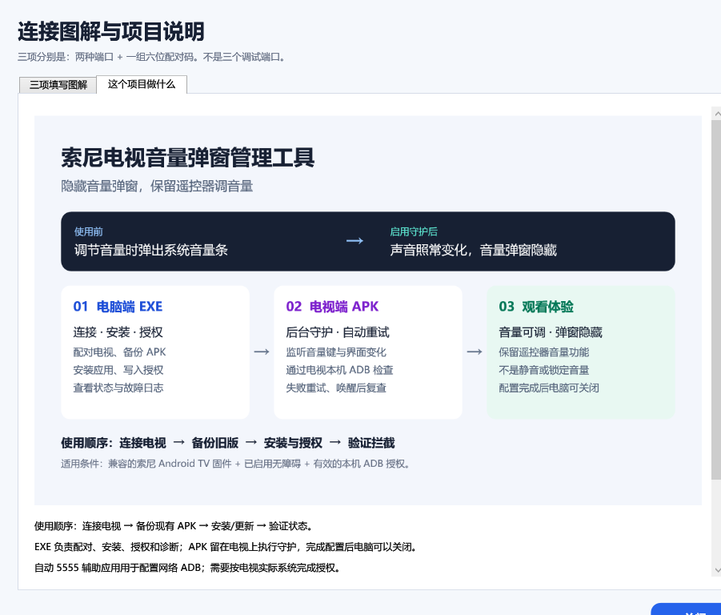

# SonyVolumeGuiKiller

索尼 Android TV 音量弹窗管理工具，包含电视端 APK 1.0.4 和 Windows 电脑管理端。隐藏音量弹窗，同时保留遥控器调音量功能。



[下载 APK 与 Windows 工具包](https://github.com/gukey/SonyVolumeGuiKiller/releases/tag/v1.0.4) · [图文使用说明](docs/使用说明.md)

Windows 工具请完整解压 ZIP 后运行 EXE；三个连接输入框均为中文，并内置配对图解。源码位于 `pc/`，构建见 [PC 构建说明](pc/README.md)。构建产物仅在 Releases 发布，不提交密钥、设备备份或日志。

自动 5555 辅助 APK 已基于上游 v0.3.5 加入持续健康检查与恢复，配套版本为 **0.3.5-sony.1**，源码与更新注意事项见 [辅助服务说明](adb-auto-enable/README.md)。旧的 0.2.7-codex-fix 已归档；音量屏蔽 APK 仍使用 1.0.4。已完成索尼电视短时故障恢复测试，长期运行仍需观察。

[下载新版辅助 APK 与 PC 1.0.5 测试包](https://github.com/gukey/SonyVolumeGuiKiller/releases/tag/adb-helper-v0.3.5-sony.1)。自动测试 8 项通过，Android lint 0 错误、31 条警告（含上游资源及界面警告）；PC 发布与窗口加载检查通过。真机已验证进程终止后恢复、5555 中断后自动恢复和短时待机唤醒，详情见 [实测记录](docs/辅助服务实测.md)。长期稳定性尚待观察，保持预发布状态。

## 工具截图与使用步骤



以上是实际窗口渲染的演示界面，IP、端口、配对码均为示例；设备状态未连接，不代表真机诊断结果。

1. 完整解压 Windows 工具包，运行 EXE，在左侧填电视 IP。
2. 先记下电视“无线调试”主页面的调试端口，再打开“使用配对码配对设备”。
3. 将配对弹窗中的端口和六位配对码填入①②，主页面的调试端口填入③；保持弹窗打开，点击“连接电视”。
4. 已配对时①②一起留空，只填当前调试端口；已开启固定网络 ADB 时可使用 5555。
5. 安装前备份；完成安装与授权后检查拦截状态。签名不同的旧 APK 不能直接覆盖，授权数据需要单独备份。



点击连接区“这三项怎么填？查看图解”或左侧“说明”，即可离线查看上述帮助。



“这个项目做什么”标签解释电脑工具、电视守护和观看效果。完整安装、连接、适用范围见 [图文使用说明](docs/使用说明.md)。

## 本次稳定性修复

- ADB 操作最多持续 12 秒，超时强制关闭 socket，覆盖持续收包、认证循环、shell 不结束和写入阻塞；服务退出时也会主动关闭连接。
- 限制 ADB 包长和 shell 输出，避免异常数据导致大量内存分配。
- 工作线程串行执行，合并音量/SystemUI 事件；执行中的事件保留一次补查，避免排队失控或直接丢弃。
- 成功后每 5 秒复查，失败后按 1/2/4/8 秒退避重试；电视亮屏、解锁时立即检查。
- 开机广播立即返回，由持久化 JobScheduler 任务处理开机、升级及约 15 分钟一次的后台兜底检查，移除原来约 190 秒的 goAsync 挂起。
- 不再覆盖 enabled_accessibility_services，不再自动启用其他应用的无障碍服务，尊重用户主动关闭。
- 页面显示连接状态、最近成功时间和错误，提供“立即检查 / 重试”。

## 适用条件与限制

需要先启用本应用的无障碍服务，并将电视已授权的 `adbkey` 和 `adbkey.pub` 放入应用私有 files 目录。沿用本地回环 ADB 端口 5555、45647、33821、65000。端口关闭或授权撤销时会重试，但普通应用不能自行开启 adbd 或批准自己的授权。

`service call audio 97 null` 是沿用旧版本的索尼固件相关调用，并非稳定 Android API。仅在 dumpsys 验证控制器为空时报告成功；系统升级后若事务编号改变，需要重新核对固件，不能通过任意试探其他编号处理。

系统完全解除无障碍绑定时，后台任务可临时清除 GUI，但不能代替每 5 秒的守护；请在无障碍设置中关闭再开启本服务，无需重启电视。系统任务可能被待机策略延后；强行停止应用后需用户再次打开。此版本不承诺绕过系统的强行停止或权限撤销。

## 构建与验证

JDK 17、Android SDK 35：

```powershell
./gradlew.bat testDebugUnitTest assembleDebug lintDebug
```

输出 `app/build/outputs/apk/debug/app-debug.apk`。debug 构建支持原有 PC 客户端通过 run-as 写入 key。签名必须与电视上原 APK 一致才能直接覆盖；不要为绕过签名错误直接卸载而丢失授权文件。

测试覆盖正常 shell、超时后重新连接、持续收包不结束、负数/超大包长、输出上限、取消阻塞读取、控制器结果识别。真机还需检查长时间运行、连续音量键、待机唤醒、ADB 中断后恢复和服务重新连接。

## 实现依据

Android 官方要求广播快速完成，延后的后台工作交给系统任务：
[BroadcastReceiver](https://developer.android.com/reference/android/content/BroadcastReceiver)、
[JobService](https://developer.android.com/reference/android/app/job/JobService)。
无障碍的绑定与反馈中断按 [AccessibilityService](https://developer.android.com/reference/android/accessibilityservice/AccessibilityService) 生命周期处理。
